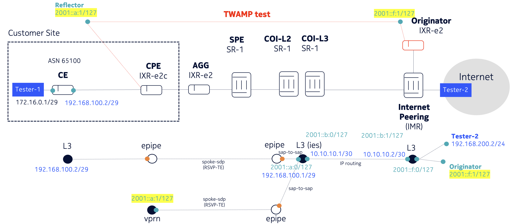

# Nokia TWAMP Test Lab with Containerlab

This is a Nokia lab demonstrating TWAMP (Two-Way Active Measurement Protocol) testing between network devices using Nokia SR OS simulators. The lab includes a complete network topology with TWAMP originator and reflector endpoints for performance measurement testing.



## Overview

The lab implements a TWAMP test scenario where:
- **Originator**: Nokia IXR-e2 device that initiates TWAMP tests
- **CPE (Reflector)**: Nokia IXR-e2c device that reflects TWAMP packets back to the originator
- **Network Path**: Complete L2/L3 network infrastructure between originator and CPE

The TWAMP session measures round-trip delay and packet loss between the originator (172.20.20.108) and CPE endpoints through a realistic network topology including aggregation, service provider edge, and core networking elements.

## Lab Components

### Network Devices
- **ce**: Customer Edge (Nokia IXR-e2c)
- **cpe**: Customer Premises Equipment (Nokia IXR-e2c) - TWAMP Reflector
- **agg**: Aggregation Router (Nokia IXR-e2)
- **spe**: Service Provider Edge (Nokia SR-1)
- **coi-l2**: Core of Internet L2 (Nokia SR-1)
- **coi-l3**: Core of Internet L3 (Nokia SR-1)
- **peering**: Peering Router (Nokia SR-1)
- **originator**: TWAMP Test Originator (Nokia IXR-e2)

### Test Endpoints
- **tester1**: Linux host (172.16.0.2) connected to CE
- **tester2**: Linux host (192.168.200.2) connected to peering router

## Getting Started

### Prerequisites
- Containerlab installed
- Nokia SROS license file available
- Docker with Nokia SR OS simulator images

### Deployment

1. **Deploy the topology:**
   ```bash
   sudo containerlab deploy -t topo.clab.yml
   ```

2. **Verify deployment:**
   ```bash
   sudo containerlab inspect -t topo.clab.yml
   ```

**Note:** Make sure you have updated/uploaded the Nokia SROS License File in the location specified in the license section of the topology file (`../license-srsim25.txt`).

## TWAMP Configuration

### TWAMP Session Details
- **Session Name**: `toCPE`
- **Test Direction**: Originator (172.20.20.108) → CPE (172.20.20.102)
- **Source Address**: `2001::f:1` (Originator)
- **Destination Address**: `2001::a:1` (CPE Reflector)
- **UDP Port**: 64364
- **Test ID**: 100708
- **Interval**: 10 seconds (10000ms)
- **Pad Size**: 5 bytes

### Key Configuration Elements

#### Originator Configuration
- TWAMP-Light reflector enabled on originator device
- OAM-PM session configured with delay measurement template
- IPv6 addressing for TWAMP endpoints

#### CPE Reflector Configuration  
- TWAMP-Light reflector service configured
- Accepts TWAMP tests from originator prefix range
- VPRN service for TWAMP traffic isolation

## Performance Monitoring

### Collecting TWAMP Statistics

To retrieve the average round-trip delay from the TWAMP test session, use the provided script:

```bash
./gnmic_twamp.sh
```

This script uses gNMI to subscribe to TWAMP statistics and extracts the average delay measurement from the originator device.

**Manual gNMI Command:**
```bash
gnmic -a 172.20.20.108 -u grpc -p telemetry --insecure subscribe \
  --path "/state/oam-pm/session[session-name=toCPE]/ip/twamp-light/statistics/delay/measurement-interval[duration=raw]/number[mi-number=1]/bin-type[bin-metric=fd]/round-trip/average" \
  | grep average
```

If gnmic does not provide any results, use the debug option:
```bash
gnmic -a 172.20.20.108 -d -u grpc -p telemetry --insecure subscribe \
  --path "/state/oam-pm/session[session-name=toCPE]/ip/twamp-light/statistics/delay/measurement-interval[duration=raw]/number[mi-number=1]/bin-type[bin-metric=fd]/round-trip/average" \
  | grep average
```

### Available Metrics
- Round-trip delay (average, minimum, maximum)
- Forward and backward delay measurements
- Packet loss statistics
- Jitter measurements
- Streaming telemetry data

## Network Architecture

The lab implements a realistic service provider network with:
- **Access Layer**: CE and CPE devices
- **Aggregation Layer**: AGG router with MPLS connectivity
- **Core Layer**: SPE and COI routers providing L2/L3 services
- **Peering Layer**: External connectivity simulation

### Protocol Stack
- **L2**: Ethernet, VLAN (802.1Q)
- **L3**: IPv4/IPv6, ISIS, MPLS
- **Services**: VPRN, EPIPE
- **OAM**: TWAMP-Light for performance measurement

## File Structure

```
twamp_coi/
├── topo.clab.yml              # Main topology definition
├── topology.png               # Network diagram
├── gnmic_twamp.sh             # TWAMP statistics collection script
├── save_config.sh             # Configuration backup script
├── startup_config/            # Device startup configurations
│   ├── originator.partial.txt # TWAMP originator config
│   ├── cpe.partial.txt        # TWAMP reflector config
│   └── *.partial.txt          # Other device 
```

## Troubleshooting

### Common Issues

1. **License File Missing**: Ensure Nokia SROS license is available at the specified path
2. **Port Conflicts**: Check if management ports (172.20.20.x) are available
3. **TWAMP Session Down**: Verify IPv6 connectivity between originator and CPE
4. **gNMI Connection Issues**: Confirm grpc user credentials and device accessibility

### Verification Commands

**Check TWAMP session status on originator:**
```bash
ssh admin@originator

A:admin@originator# show oam-pm statistics session "toCPE" twamp-light meas-interval raw 

------------------------------------------------------------------------------
Start (UTC)       : 2025/09/09 15:40:55          Status          : in-progress
Elapsed (seconds) : 58                           Suspect         : yes
Frames Sent       : 6                            Frames Received : 6
------------------------------------------------------------------------------
===============================================================================
TWAMP-LIGHT DELAY STATISTICS

----------------------------------------------------------------------------
Bin Type     Direction     Minimum (us)   Maximum (us)   Average (us)   EfA
----------------------------------------------------------------------------
FD           Forward               5472           6633           5865    no
FD           Backward              5175           6260           5631    no
FD           Round Trip           10794          12432          11497    no
FDR          Forward                  0           1161            344    no
FDR          Backward                 0           1085            456    no
FDR          Round Trip               0           1638            703    no
IFDV         Forward                163            720            336    no
IFDV         Backward               268            910            546    no
IFDV         Round Trip             566           1188            817    no
----------------------------------------------------------------------------
EfA = yes: one or more bins configured to be Excluded from the Average calc.

---------------------------------------------------------------
Frame Delay (FD) Bin Counts
---------------------------------------------------------------
Bin      Lower Bound       Forward      Backward    Round Trip
---------------------------------------------------------------
0               0 us             0             0             0
1            5000 us             6             6             0
2           10000 us             0             0             6
---------------------------------------------------------------

---------------------------------------------------------------
Frame Delay Range (FDR) Bin Counts
---------------------------------------------------------------
Bin      Lower Bound       Forward      Backward    Round Trip
---------------------------------------------------------------
0               0 us             6             6             6
1            5000 us             0             0             0
---------------------------------------------------------------

---------------------------------------------------------------
Inter-Frame Delay Variation (IFDV) Bin Counts
---------------------------------------------------------------
Bin      Lower Bound       Forward      Backward    Round Trip
---------------------------------------------------------------
0               0 us             5             5             5
1            5000 us             0             0             0
---------------------------------------------------------------
===============================================================================
===============================================================================
TWAMP-LIGHT LOSS STATISTICS: NONE
===============================================================================
```

**Verify TWAMP reflector on CPE:**
```bash
ssh admin@cpe
show router service-name "twamp" twamp-light 
```

**Test network connectivity:**
IPv6 ping from Originator to CPE
```bash
ssh admin@originator
ping 2001::a:1 source-address 2001::f:1
```

## Save configurations

To save additional changes to the topology, make sure to run script below which will copy all config.cfg files to the ./config directory.
```bash
./save_config.sh
```

## Cleanup

To destroy the lab:
```bash
sudo containerlab destroy -t topo.clab.yml
```
